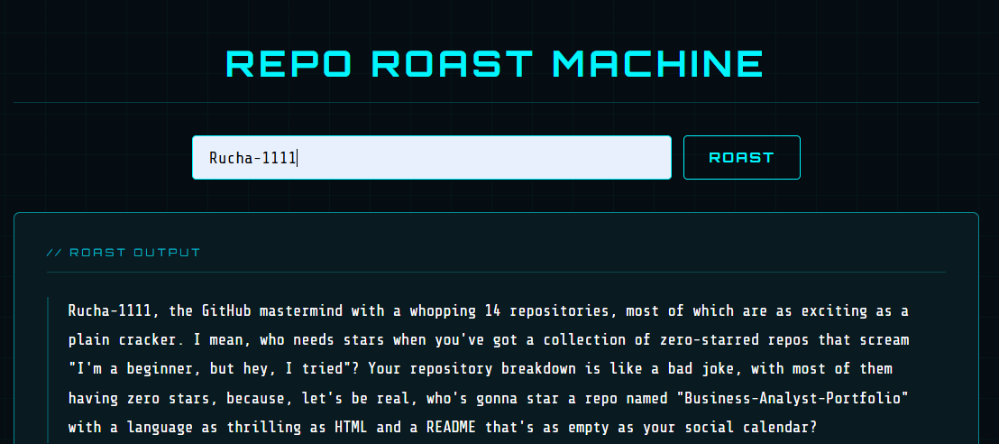
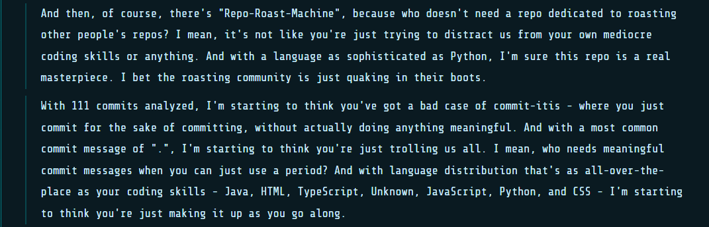
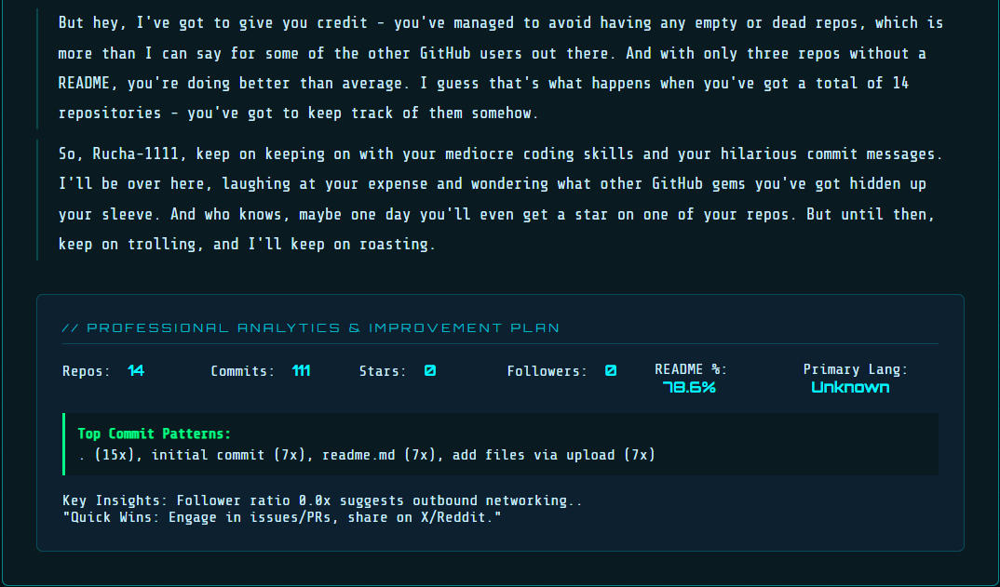

# 🔥 Repo Roast Machine

### *Your GitHub. Audited. Profiled. Roasted.*

<p align="center">
  
</p>

<p align="center">
  <b>34 repos analyzed • 8 behavioral signals • 0 mercy</b>
</p>

---

## 🧨 What this is

A behavioral analysis engine disguised as a roast tool.

You enter a GitHub username.
It extracts patterns from real data.
Then generates a context-aware roast using those patterns.

No randomness.
No generic insults.
Everything ties back to your actual code history.

---

## 🖥️ Product Preview

<p align="center">
  <br/>
  <br/>
  
</p>

---

## 🧠 Signal Extraction Engine

```text
Repository Naming Patterns     → final_v2_last_REAL
Commit Message Behavior       → "fix", "pls work", "ok done"
Project Completion Ratio      → active vs abandoned
README Coverage               → documented vs neglected
Language Distribution         → focused vs scattered
Activity Timeline             → consistent vs burst-based
Engagement Metrics            → stars, followers
```

---

## 💀 Sample Output

> 28 repositories detected. 16 of them are some variation of “final”.
> That’s not versioning. That’s coping.
>
> Your commit history escalates like a system under stress:
> “fix”, “fix again”, “ok working”, “wait no”.
>
> Your README coverage suggests documentation is an optional feature.
>
> This is not a portfolio.
> It is version-controlled indecision.

---

## ⚙️ Architecture

```text
[ Username Input ]
        ↓
[ GitHub API Layer ]
        ↓
[ Data Structuring ]
        ↓
[ Behavioral Analysis Engine ]
        ↓
[ Prompt Engineering Layer ]
        ↓
[ LLM (Roast Generation) ]
        ↓
[ UI Rendering Engine ]
```

---

## 🏗 Tech Stack

| Layer       | Technology                            |
| ----------- | ------------------------------------- |
| Backend     | Flask (Python)                        |
| Frontend    | HTML, CSS, JavaScript                 |
| Data Source | GitHub REST API                       |
| AI Engine   | Groq (LLaMA 3.3)                      |
| Processing  | Custom analytics + prompt engineering |

---

## 🚀 Run Locally

```bash
git clone https://github.com/Rucha-1111/Repo-Roast-Machine.git
cd Repo-Roast-Machine
pip install -r requirements.txt
python app.py
```

Open:

```
http://127.0.0.1:5000
```

---

## 🔐 Environment

```env
GITHUB_TOKEN=your_github_token
GROQ_API_KEY=your_groq_api_key
```

---

## 📁 Project Structure

```
/project
 ├── app.py
 ├── utils.py
 ├── index.html
 ├── static/
 │    └── style.css
 ├── assets/
 │    ├── emotionaldamage1.png
 │    ├── emotionaldamage2.png
 │    └── emotionaldamage3.png
 └── .env
```

---

## ⚠️ Constraints

* Uses only public GitHub data
* Subject to GitHub API rate limits
* No fabricated insights — only derived patterns

---

## 📉 Philosophy

Most tools optimize for:

> activity

This system exposes:

> behavior

---

## 📜 License

Educational use only.

Possible side effects:

* deleting half your repositories
* rewriting commit history
* renaming everything from “final”
